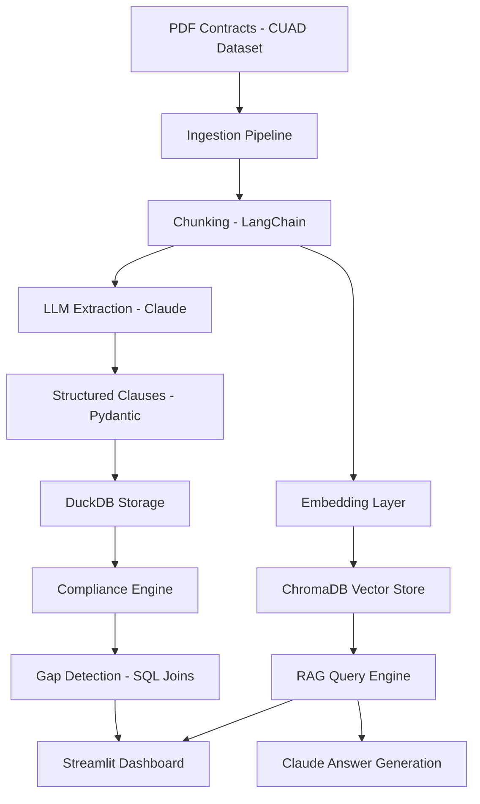

# Procurement Contract Intelligence (End-to-End) — AI + Supply Chain

AI-powered contract analysis, compliance monitoring, and semantic search platform for procurement teams.  
This project demonstrates **production-grade LLM engineering** applied to real-world supply chain workflows.


---

## Why this project

Procurement organizations manage hundreds of contracts, but face key challenges:

- Contracts are stored as **unstructured PDFs**
- **Limited visibility** into critical clauses (pricing, penalties, renewals)
- Compliance monitoring is **reactive instead of proactive**
- No direct linkage between **contract terms and operational data (purchase orders)**

### Solution

This project transforms procurement into a **data-driven, AI-enabled function** by:

- Extracting structured contract clauses using LLMs  
- Detecting compliance gaps vs real purchase orders  
- Enabling natural language querying across all contracts (RAG)  
- Providing an interactive dashboard for decision-making  

---

## Business problem

Procurement teams operate across large portfolios of contracts, but lack scalable mechanisms to:

- Extract **structured information** from unstructured PDFs  
- Monitor compliance between **contract terms and actual purchase orders**  
- Detect risk exposure (pricing deviations, penalties, renewal deadlines)  
- Enable fast, intuitive access to contract knowledge  

### Objective

Design an end-to-end AI system capable of:

- Automating clause extraction using LLMs  
- Linking contract terms with operational data  
- Detecting compliance gaps in near real-time  
- Enabling natural language querying across the full contract corpus  

---

## Business impact (simulated)

### Before (traditional procurement)

- Manual, time-consuming contract review  
- Reactive compliance monitoring  
- Limited visibility into pricing deviations  
- High risk of missed renewal deadlines  

### After (AI-powered system)

- Automated clause extraction at scale  
- Real-time compliance monitoring vs actual POs  
- Instant contract Q&A via RAG  
- Proactive alerts for renewals and penalties  

### Quantified impact (illustrative)

- **80–90% reduction** in manual contract review time  
- **30–50% faster** identification of pricing discrepancies  
- **Full visibility (100%)** across contract portfolio  
- **Reduced financial and operational risk exposure**  

> *Note: Impact estimates are based on simulated scenarios using CUAD contracts and SCMS operational data.*

---

## System architecture

### Architecture Diagram


### Logical flow


---

## Tech stack

### AI / LLM
- **Anthropic Claude** — structured clause extraction and RAG answer generation  
- **LangChain** — chunking strategy and orchestration  
- **SentenceTransformers** — embeddings for semantic search  

### Data & Storage
- **DuckDB** — analytical database for clauses and compliance joins  
- **ChromaDB** — vector database for RAG retrieval  
- **PyMuPDF (`fitz`)** — PDF parsing and text extraction  

### Backend & APIs
- **FastAPI** — API layer for contract intelligence (RAG endpoint)  
- **Pydantic v2** — schema validation for LLM outputs  

### UI & Analytics
- **Streamlit** — interactive dashboard (4-page UI)  
- **Plotly** — visual analytics and charts  

### Testing
- **pytest** — unit tests for ingestion, schema, and compliance engine  

---

## API layer (FastAPI)

Expose contract intelligence via a production-ready API.

### Endpoint

```bash
POST /ask

Request

{
  "question": "What penalties apply for late delivery?"
}

```
```bash

Response
{
  "answer": "Late delivery incurs a 5% penalty after 7 days...",
  "sources": ["contract_12.pdf", "contract_7.pdf"]
}

```

### Integration use cases

This API enables seamless integration with:
- Procurement systems (ERP / sourcing platforms)
- Internal copilots (LLM-powered assistants)
- Enterprise dashboards (Power BI, custom analytics tools)

## Dataset

### Contracts
- **CUAD (Contract Understanding Atticus Dataset)**
- 31 procurement contracts
- ~1,957 processed chunks

### Operations data
- **SCMS Delivery History Dataset**
- ~10,324 purchase orders
- Used for compliance validation

---

## How it works (end-to-end)

### 1. Ingestion
- Extract text from PDFs using PyMuPDF
- Split into chunks with LangChain

### 2. LLM extraction
- Claude extracts structured clauses
- Pydantic enforces schema
- Results are stored in DuckDB

### 3. Compliance engine
SQL joins between:
- contract clauses
- purchase orders

Detects:
- pricing gaps
- penalties
- renewal risks

### 4. RAG layer
- Embed chunks in ChromaDB
- Retrieve relevant context
- Claude generates grounded answers

### 5. Dashboard
- Contract explorer
- Compliance gap analysis
- Interactive charts
- Chat interface

## Project structure

```text
procurement-contract-intelligence/
├── ingestion/      # PDF parsing and chunking
├── extraction/     # LLM-based clause extraction
├── compliance/     # Gap detection and validation logic
├── rag/            # Embeddings, vector store, and Q&A
├── app/            # Streamlit dashboard
├── scripts/        # Batch execution scripts
├── notebooks/      # Evaluation and experimentation
└── tests/          # Unit tests

```

## Setup

```bash
git clone <repo-url>
cd procurement-contract-intelligence

python -m venv .venv
source .venv/bin/activate

pip install -r requirements.txt
echo "ANTHROPIC_API_KEY=your_key" >> .env

```
### Run the system

### 1. Ingestion
python scripts/run_ingestion.py
### 2. Extraction
python extraction/run_extraction.py
### 3. Build the RAG index
python rag/run_rag.py
### 4. Run the compliance engine
python compliance/run_compliance.py
### 5. Launch the dashboard
streamlit run app/dashboard.py
### 6. Start the API (optional)
uvicorn api.app:app --reload

### Testing
pytest tests/ -v

## What makes this project different

Most AI projects focus only on **LLMs** or only on **dashboards**.

This project integrates:

- **LLM structured extraction**
- **RAG architecture**
- **Analytical database (DuckDB)**
- **Compliance analytics**
- **Interactive UI**
- **API layer**

➡️ **This is a full AI product, not just a notebook.**

---

## Portfolio positioning

This project demonstrates capabilities aligned with:

- **AI Engineer (Applied / LLM)**
- **Supply Chain Analytics Lead**
- **AI Transformation Lead (Operations)**
- **Data + AI Platform Architect**

---

## License

MIT

---

## Author

Victor Vergara
